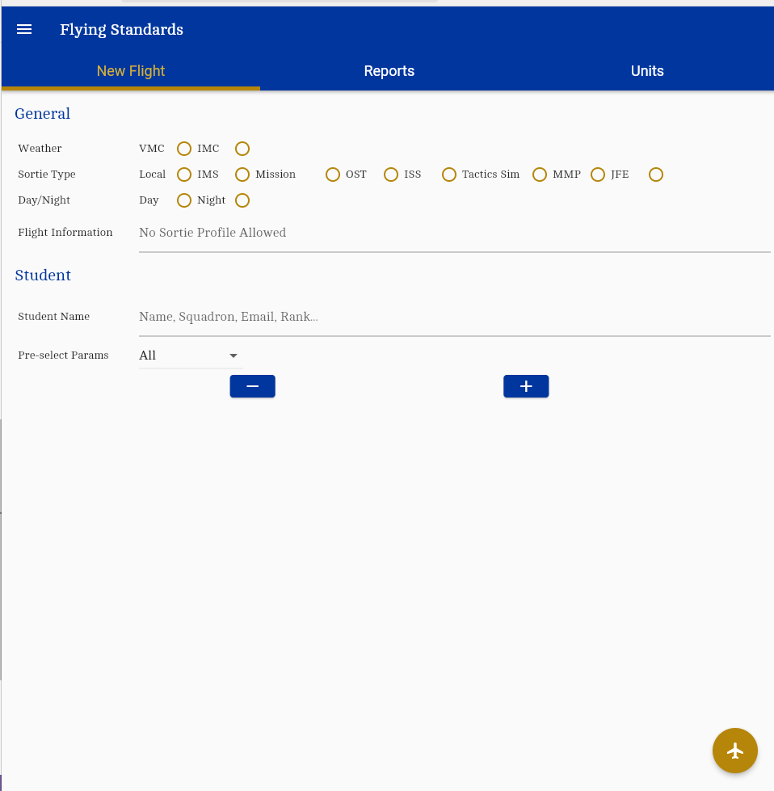
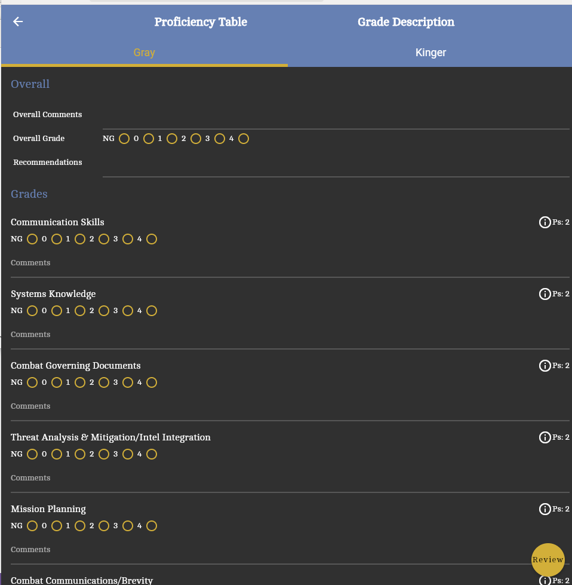

# Grading Standards

This application is for creating gradesheets for any C-17 pilot. Gradesheets can be made in flight with up to 4 people. There is a copy function on gradesheets for the Access program as well as downloading large groups of data.

## Getting Started

Grading Standards is live in three locations:

[Google Play](https://play.google.com/store/apps/details?id=com.af.grading_standards)

[Play Store](https://testflight.apple.com/join/c5rDxaxH)

[Web](https://grading-standards.web.app/#/)

It is also possible to download and compile from the source code available at: [https://github.com/AF-Grading/grading_standards.git](https://github.com/AF-Grading/grading_standards.git)

The application is built with Flutter, more information on getting started available at: [https://docs.flutter.dev/get-started/install](https://docs.flutter.dev/get-started/install)

## Navigating The App

For first sign in, most users will opt to using the `sign up` option. After finishing sign up, they will need to ask for an account from someone who already has one. Contact one of the authors of the application for help.

### Start Flight

After successful login, users are greeted by multiple tabs. The first tab, `New Flight`, is the bread and butter of Grading Standards. On this tab, users will fill out the form, including any general information. Up to 4 students are allowed on each flight. The pre-select params option is to have some of the grading criteria to be already filled out. 

{width=50%}

When ready, users will press the start flight button at the bottom right of the page.

### Current Flight

The `Current Flight` page shows the tabs for each selected user, with the pre-selected parameters showing. Users are required to fill out a grade for each of the items they selected. Pressing the `Unselected Grades` dropdown will show all the unselected criteria, with `NG` automatically filled in. Those grades can still be changed, however, and the new grade will be reflected in the `Review Grades` page. 

At the top, The `Proficiency Table` and `Grade Description` items show helpful information about the grading criteria and passing scores needed. Additionally, each criterion has an information icon that can be clicked to show the standards and performance metrics for each item. Finally, The `Ps` number shows the passing score associated with the students' pilot qualification or airdrop qualification, depending on the criterion.

{width=50%}

Once the gradesheet is filled out, the user is then taken to a review page, clicking the button once more saves the sheet. Users have no need to fear losing work when offline, as the gradesheets are saved locally, then the database is updated automatically when it gets service. 

### App Drawer

Once back at the Home Page, clicking the hamburger button at the top left brings up the navigation menu. Here, depending on the level of permissions, users will see different things. `My Grade Sheets` is the gradesheets the user has created. `All Grade Sheets` and `Users` are lists of all of the available items, users and gradesheets can be edited in each of their respective pages. On an individual grade sheet, a copy option is also available. A formatted version of the gradesheet will be saved to the clipboard, with a similar look as the output of the old Excel file.

{width=50%}

For wing training level users, they will also see tabs fos `Parameters` and `Grading Criteria`. New items can be added or edited there as well. In the `Settings` page, users can select light mode or dark mode, as well as sign out. 

### Statistics

Back on the Home Page, there are two tabs left. The `Reports` tab details individual reports for each user. On the web, a csv file for each student can be downloaded on the top right. The start date and end date pickers allow the user to select the time frame upon which to view statistics for. `Top` and `Bottom` display the highest or lowest individual criterion, whereas the `Strong` and `Weak` show the highest or lowest averages.

The `Units` tab is similar to the `Reports`, but for entire squadrons instead. Instuctors only have access to their squadron, Training Shop has access to their wing, and Wing Training has access to all squadrons. Again, on the web csv files can be downloaded and exported to Excel. 
